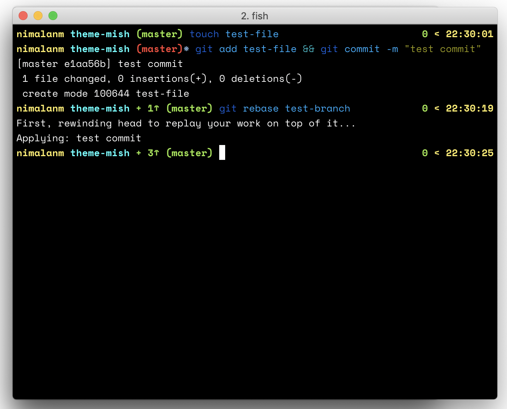

# mish

A minimal fish theme with just the essentials

### Feature

#### Left Prompt
- Branch name, `*` is branch is dirty
- Displays number of commits the repository is above or behind the repository
- Shows only the folder name

#### Right Prompt
- Status code
- Time stamp
